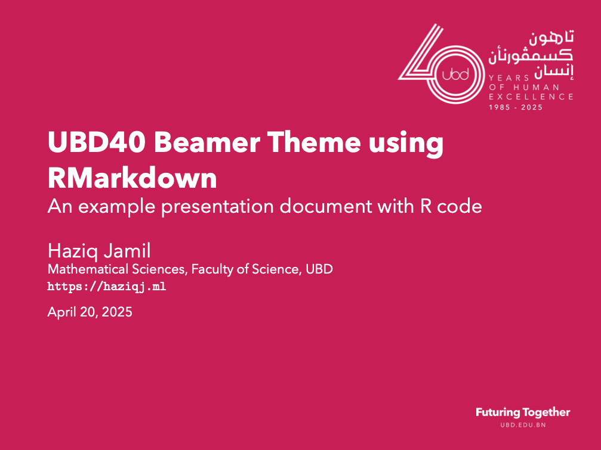
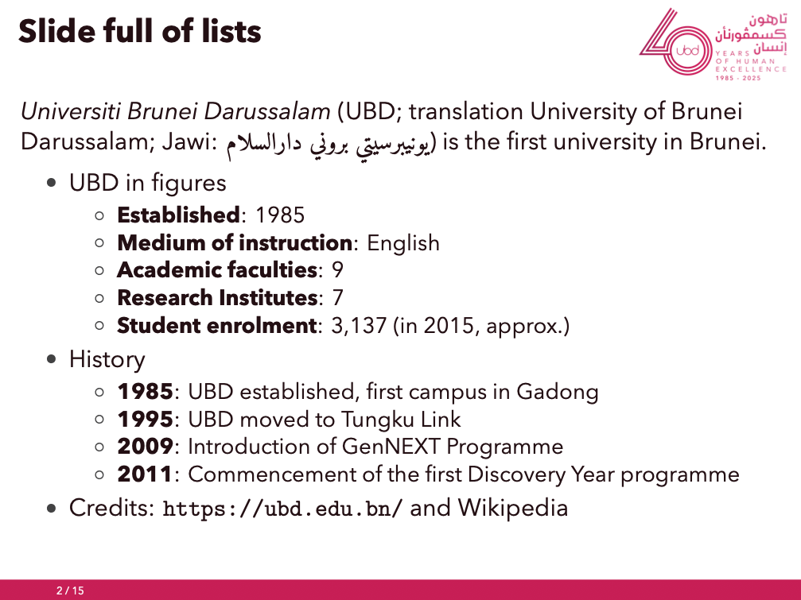
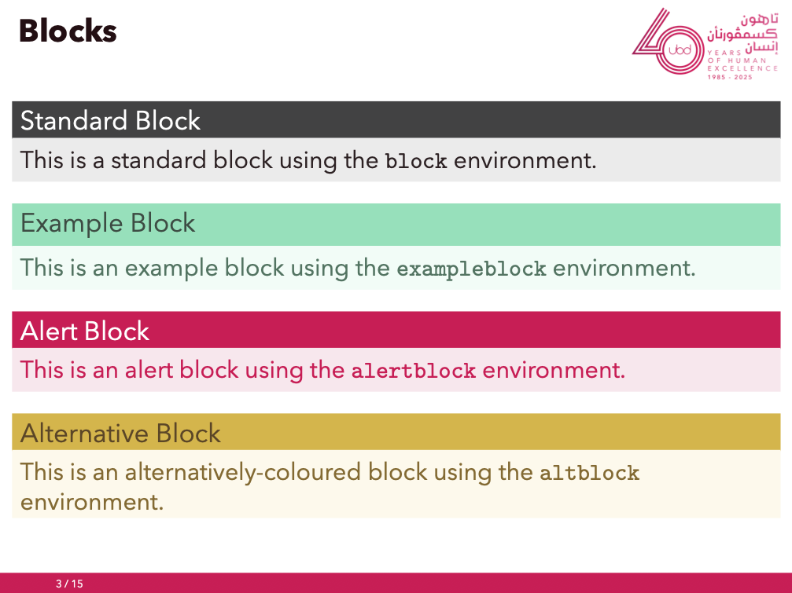
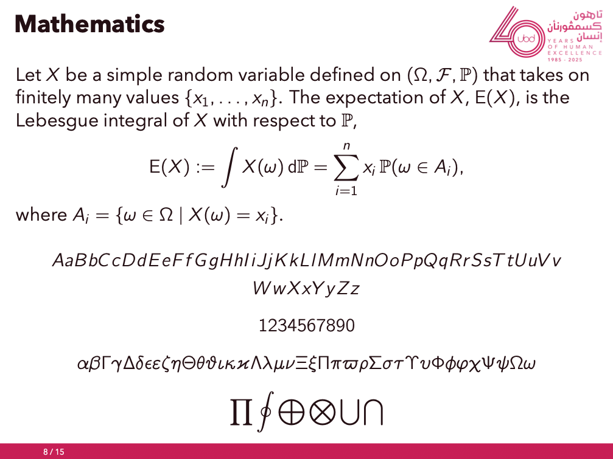

# UBD Beamer Theme

*HAPPY 40th BIRTHDAY UBD!*

This is the unofficial beamer theme designed for [Universiti Brunei Darussalam](https://ubd.edu.bn), featuring the UBD 40th Anniversary Ruby pallette.
View the [PDF slides](https://github.com/haziqj/ubd-beamer/blob/main/slides_rmd.pdf).

  
  
  
  

## Usage

To use this theme, copy the 

1. `beamerthemeUBD.sty`;
2. `logos/` folder; and
3. `fonts/` folder,

and place these together in your working directory.
Use the sample `minimal_example.tex` file as a guide.

Additionally, if using Rmd (in RStudio for example), then add also

4. `ubd_beamer_rmd.tex`; and
5. `luafilters/` folder

to your working directory.
Edit the `slides_rmd.Rmd` to your liking.

## Beamer options

- `progressdots` provides progress dots by sections at the top of each slide. (Not recommended, messes up with the top right logo!)
- `transitions` provides transition slides between sections.
